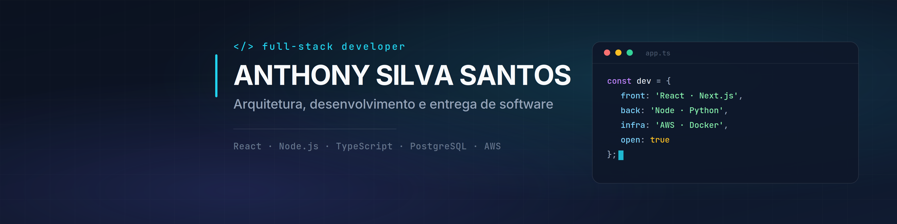

# Anthony Silva Santos

Belém, Pará — Brasil 🇧🇷

---

## Sobre

Construo aplicações web de ponta a ponta — da modelagem do banco de dados à interface que o usuário toca. Meu foco está em escrever código legível, testável e que sobreviva ao próximo desenvolvedor que abrir o repositório.

- 🔭 Atualmente trabalhando em **[NOME DO PROJETO ATUAL]**
- 🌱 Aprofundando em **[O QUE VOCÊ ESTÁ ESTUDANDO]**
- 💬 Fale comigo sobre **React, Node.js, TypeScript e boas práticas de API**
- 📫 Contato: **SEU@EMAIL.com**

---

## Stack

**Front-end**

**Back-end**

**Banco de dados & Infraestrutura**

**Ferramentas**

---

## Projetos em destaque

| Projeto | Descrição | Stack | Links |
|---|---|---|---|
| **[NOME DO PROJETO 1]** | O problema que ele resolve, em uma linha. | React · Node · PostgreSQL | [Código](https://github.com/SantosAnthony/repo-1) · [Demo](https://link-da-demo.com) |
| **[NOME DO PROJETO 2]** | O problema que ele resolve, em uma linha. | Next.js · Prisma · AWS | [Código](https://github.com/SantosAnthony/repo-2) · [Demo](https://link-da-demo.com) |
| **[NOME DO PROJETO 3]** | O problema que ele resolve, em uma linha. | TypeScript · NestJS · Docker | [Código](https://github.com/SantosAnthony/repo-3) · [Demo](https://link-da-demo.com) |

---

## Estatísticas

  

---

### Vamos conversar

Estou aberto a oportunidades e colaborações.

